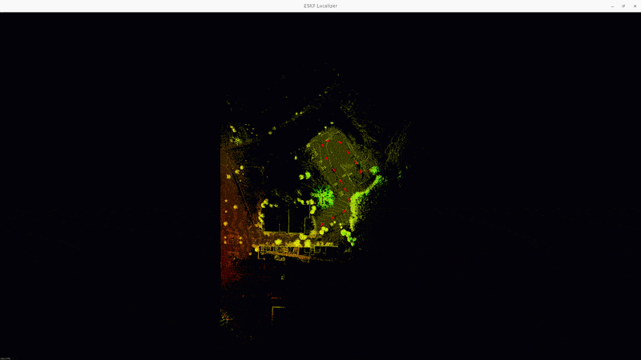
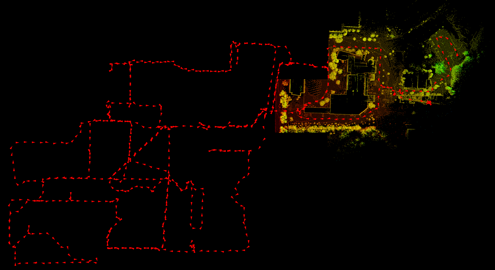
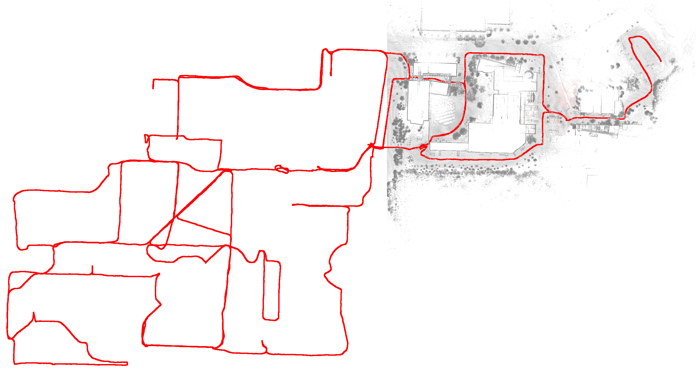
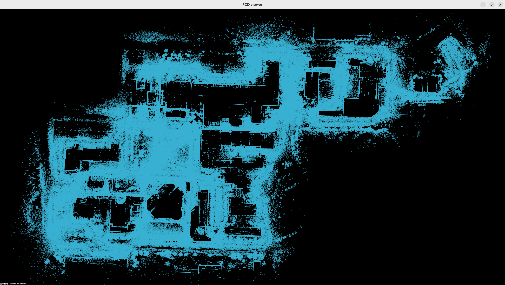
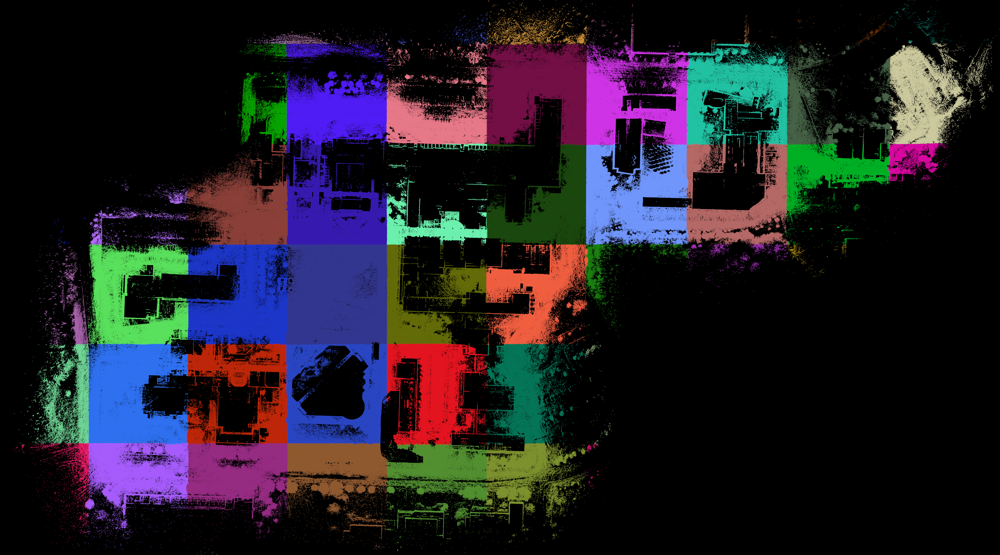

## Localization

### Components

1. Initialization
2. ESKF
3. NDT alignment
4. Dynamic map loading
5. Multithread processing

### Results

- executables:
  - main localizer: `./bin/main_localizer`

    

    

  - multi-thread version (with pangolin visualizer): `./bin/main_localizer_mt`

    

    

- global map

   

### Initialization

Goal: loading configuration, map loading, imu initialization, estimate the initial state of robot.

#### Procedure

1. reading configurations file: obtain meta data like imu lidar extrinisic, GNSS origin, sensor specs, etc.
2. map loading: load submaps info (i.e., submap id, path of point cloud files) created by the mapping module
3. IMU initialization: given the static state of robot, compute the sample mean and variance of accerometer and gyroscope, obtain bias and covariance of acc and gyr, gravity.
4. initial state estimation:
   1. wait for the first valid gnss data
   2. use gnss position as the initial position, map cloud as target, current scan as source, do NDT alignment with decreasing resolution and different orientation.
   3. the alignment result, zero velocity and imu configuration are used as the initial state of ESKF.

- [source code](src/localizer/LocalizerEskf.cpp)

### ESKF

Goal: estimate state given imu and lidar scan.

#### Procedure

1. prediction: integrate imu data, compute position, velocity, orientation, bias of accerometer and gyroscope, gravity, and covariance of measurment noise.
2. correction: given NDT alignment result (current pose), compute error state and Kalman gain, correct the nominal states and reset the error.

- [source code](src/localizer/eskf.cpp)

### NDT alignment

Goal: based on the predicted pose from eskf, optimize the pose such that the residual of NDT alignment of target and source point cloud is minimized.

#### Procedure

1. target cloud: the point cloud of the current map.
2. undistort the raw point cloud influenced by the motion
   1. align each scan point with imu reading, compute the the pose of lidar (imu) sensor by interoplation, i.e., $T_{W I_i}$.
   2. transform each scan point to the frame of the last imu reading, i.e., $p_{L_e} = T_{LI} * T_{I_e W} * T_{W I_i} * T_{IL} * p_{L_i}$
3. source cloud: the point cloud of the current undistored lidar scan.
4. the initial guess is given by eskf prediction and alignment result is used as observation for eskf correction.

- [source code](src/localizer/LocalizerEskf.cpp)

### Dynamic map loading

Goal: to save memory usage, load and unload map based on current position. This is processing in seperate thread.

#### Procedure

0. partition map into submaps (done in mapping module)
1. load map meta data at the initialization stage, including id and path of each submap file
2. based on the pose estimate from eskf, load the submaps that are close to current position, unload submaps that are far away (e.g., euclidian or manhattan distance of the map id).

- [source code](src/localizer/LocalizerEskf.cpp)

### Multithread processing

Goal: reduce delay at the dynamic loading caused by building kd tree for NDT target cloud. Execute state esitimation and dynamic map loading concurrently.

#### Procedure

1. two seperate thread: a. ESKF state estimation. b. dynamic map loading.
2. the main thread is for the ESKF state estimation. After the correction step, the main thread wakes up dynamic map loading thread by c++ `std::conditio_variable if map change is needed.
3. the dynamic map loading thread is a event loop waiting for the notification from the main thread. Once woke up, it update viewer and kd tree of NDT target.
4. NDT object is the data modified by both thread. A `mutex` is used for NDT object to avoid data race.

- [source code](src/localizer/LocalizerEskfMT.cpp)

#### issue

1. NDT score from different version of pcl are different. The older version (1.10) works better.
2. Error handling: relocalization if ndt alignment fails. a. multi-level grid search using NDT alignment with GNSS initial position. b. other point cloud registration like ICP.
3. Dynamic environment: maintain a local map during localization (using lio etc), detecting environmnet change during localization, update static map
